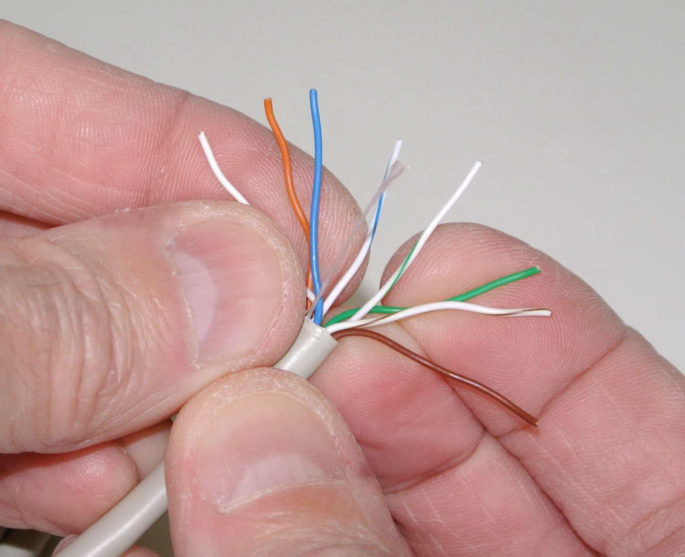
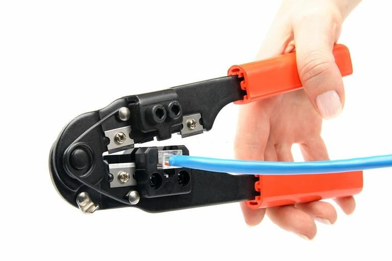
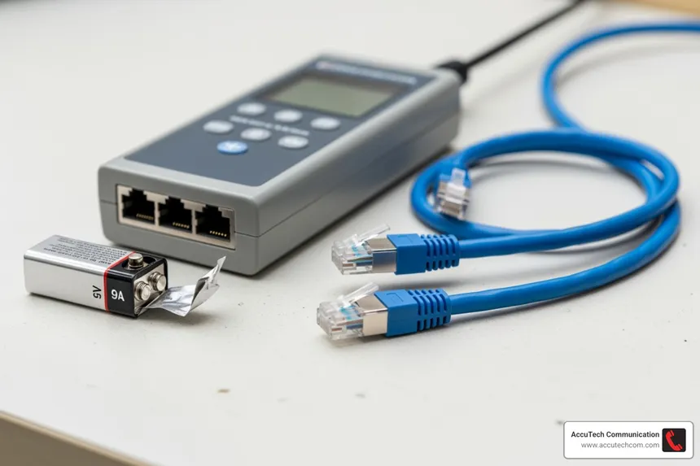
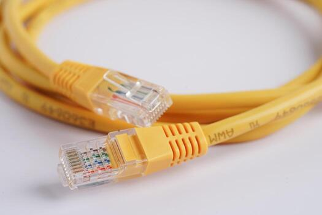
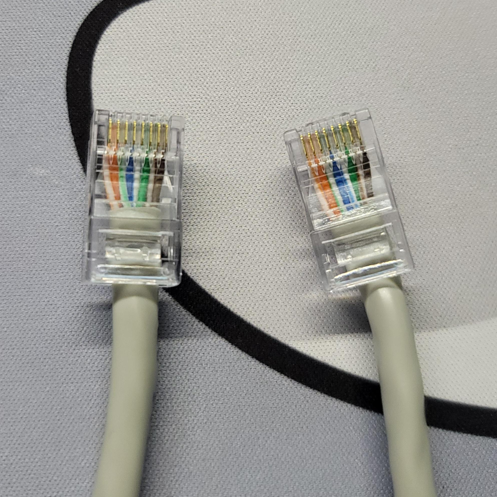

# RJ45 Cable Crimping

## Aim

To crimp an **RJ45 Ethernet cable** using the **T568B wiring standard** and verify the completed cable using an Ethernet cable tester.

---

## Requirements

- Ethernet cable (Cat5e/Cat6)
- RJ45 connectors
- RJ45 crimping tool
- Ethernet cable tester
- Cable cutter/stripper

---

## Procedure

### 1. Prepare the Ethernet Cable

Cut the Ethernet cable to the required length using a cable cutter.

Remove a small portion of the outer insulation from the end of the cable using a cable stripper.

Carefully expose the eight internal wires without damaging them.

### 2. Arrange the Wires

Separate and straighten the eight individual wires.

Arrange them according to the **T568B wiring standard** in the following order:

    1. White-Orange
    2. Orange
    3. White-Green
    4. Blue
    5. White-Blue
    6. Green
    7. White-Brown
    8. Brown

Keep the wires straight and maintain the correct order.

---

### 3. Insert the Wires into the RJ45 Connector

Trim the wires evenly so that their ends are aligned.

Hold the RJ45 connector correctly and carefully insert all eight wires into the connector.

Make sure:

- All eight wires reach the end of the connector.
- The wires remain in the correct T568B order.
- The cable jacket extends slightly inside the connector.

---

### 4. Crimp the RJ45 Connector

Place the RJ45 connector into the appropriate slot of the crimping tool.

Ensure that the wires remain in their correct positions.

Firmly press the crimping tool to secure the connector to the cable.

Repeat the same process for the other end of the Ethernet cable.

---

### 5. Test the Ethernet Cable

Connect both ends of the completed Ethernet cable to an Ethernet cable tester.

Turn on the tester and observe the indicator lights.

For a correctly terminated straight-through cable, the tester should show the corresponding sequence:

    1 → 1
    2 → 2
    3 → 3
    4 → 4
    5 → 5
    6 → 6
    7 → 7
    8 → 8

If the sequence is incorrect or a light does not appear, check the wiring and connectors and repeat the crimping process if necessary.

---

### 6. Inspect the Completed Cable

Inspect both RJ45 connectors and make sure they are firmly attached to the cable.

Verify that:

- The wires follow the T568B standard.
- The connectors are properly crimped.
- The cable jacket is secured inside the connectors.
- The cable passes the continuity test.

---

## T568B Wiring Standard

| Pin | Wire Color |
|---|---|
| 1 | White-Orange |
| 2 | Orange |
| 3 | White-Green |
| 4 | Blue |
| 5 | White-Blue |
| 6 | Green |
| 7 | White-Brown |
| 8 | Brown |

---

## Result

The Ethernet cable was successfully terminated using RJ45 connectors according to the **T568B wiring standard**. The completed cable was tested using an Ethernet cable tester and verified for correct continuity.

---

## Conclusion

This lab demonstrated the process of preparing, arranging, terminating, crimping, and testing an RJ45 Ethernet cable using the T568B standard. The completed cable was successfully verified using a cable tester.